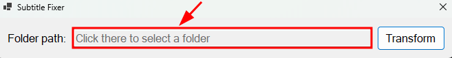

# Subtitle converter to UTF8
For subtitles with diacritics, some applications support displaying them only in UTF8 character format.

This application converts all subtitles to UTF8 format for proper subtitle display in any application.

# Reason
I use the Plex service to share downloaded movies and TV shows to my smart TV or phone when I'm on the go. Diacritics in subtitles were not displayed correctly on some devices.

One solution was to save file by file using Notepad and change the character set from ANSI to UTF-8.

Something that becomes quite boring when you download a series of 40 episodes, and you have to do the same steps, file by file.

I hope this app helps you too :satisfied:

# How to use
## Step 1
Download the application from [there](https://github.com/alexmarian99/SubtitleConverter-TO-UTF8/releases/download/v01/SubtitleFixer-win-x64.zip) and extract its content.

## Step 2
Execute SubtitleFixer.exe

## Step 3
Click on textbox highlighted bellow and select your folder where the subtitles are stored.

## Step 4
Click on transform button and wait some seconds.

## Step 5
Once its job is done, a message about how many files were converted will be displayed.
